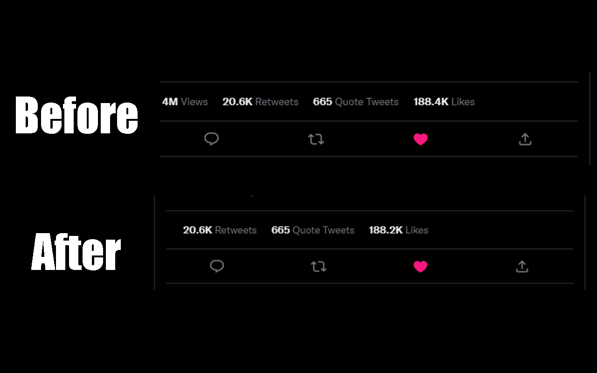

# Twitter Fucklytics

Twitter Fucklytics hides Tweet Analytics buttons because no one ever uses that feature.



# Installation

[](https://addons.mozilla.org/en-US/firefox/addon/twitter-fucklytics/)
[](https://chrome.google.com/webstore/detail/twitter-fucklytics/jnabjchofoiafnnfodhlnmdodbgbmekl)

# Building

```
npm i
//To build the Chrome version
npm run build-chrome
//To build the Firefox version
npm run build-firefox
```

you can then zip the builds using [web-ext](https://github.com/mozilla/web-ext).
